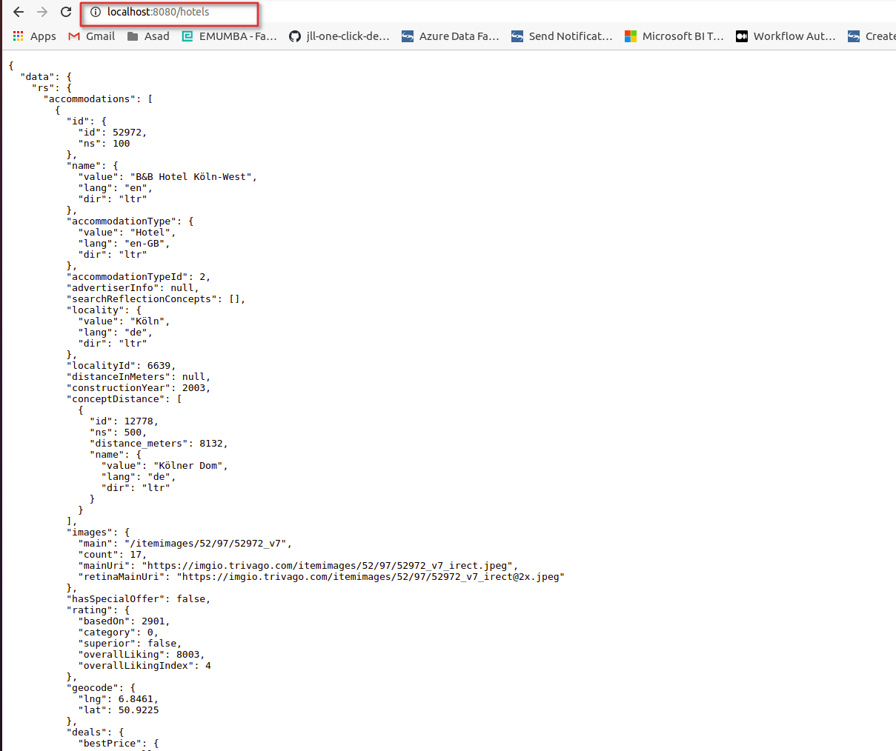

## Introduction:
In this project, i am going to containerize the two applications of java and golang using docker compose file and attach the load balancer to it, so that 70% of the requests are going to the application written in GO, 30% of the requests are going to the application written in Java


#### Pre-requisite
Applicaitons are built with following languges and their versions
1. Java 11
2. Go 1.12
3. Both applications are binding to all interfaces on port **8080**

#### Architecture
The proposed architecture of this scenario is shown below


As shown in the architecture user can send request with the help of internet gateway where load balancer of nginx can receive the request and will forward to either of java or go application

## Implementation Steps

#### Step1: Create dockerfile for Go application

Take the base image **golang:1.12.0-alpine3.9** where Go binary can be executed, copy the **golang-webserver** file to the container directory and give the file execution permissions and expose the port **8080** and finlay exectue the file as shown in the below dockerfile
```
FROM golang:1.12.0-alpine3.9

RUN mkdir /app

ADD golang-webserver /app

WORKDIR /app

RUN chmod +x golang-webserver

EXPOSE 8080

CMD ["/app/golang-webserver"]

```

#### Step2: Create dockerfile for Java application

Take the base image **adoptopenjdk/openjdk11:alpine-jre** where Java jar file can be executed, copy the **java-webserver.jar** file to the container directory and expose the port **8080** and finlay exectue the file as shown in the below dockerfile

```
FROM adoptopenjdk/openjdk11:alpine-jre	

ARG JAR_FILE=java-webserver.jar

COPY ${JAR_FILE} java-webserver.jar

EXPOSE 8080

CMD ["java","-jar","java-webserver.jar"]

```

#### Step3: Create nginx.conf file to change the configuration of load balancer nginx

This is the important file which will handle the configuraiton of nginx load balancer. As per the requirement, 70% requests should be handled with **Go app** and remaining 30% with **Java app**.
As there is anothe requirement for route **/** A static site. Should not appear in the final setup as it is but redirect to the **/hotels**

```
events { 
  worker_connections 1024; 
}

http { 
 upstream backend {
    server golang_trivago:8080 weight=7;
    server java_trivago:8080 weight=3;
 }
 server {
    listen 8080;
    rewrite ^/$ http://localhost:8080/hotels redirect;
    location / {
       proxy_pass http://backend;
    }
  }
}
```

In this **nginx.conf** file upstream backend will handle the traffic load and **golang_trivago** and **java_trivago** are refernces to container which are defined in the **docker-compose.yml** file
and redirect command is set as per the requirement

#### Step4: Create dockerfile for nginx load balancer

Take the base image as **nginx** and copy the **nginx.conf** file to **/etc/nginx/nginx.conf** and expose the port **8080** where both applications are binded together. Also se the **daemon off** so that it can run in the foreground
```
FROM nginx

COPY nginx.conf /etc/nginx/nginx.conf

EXPOSE 8080

CMD ["nginx", "-g", "daemon off;"]
```

#### Step5: Create docker-compose.yml file to run both application contaienrs along with the nginx load balancer

```
version: '3'
services:
  golang_trivago:
    build: 
      context: ./golang
      dockerfile: Dockerfile
    restart: always
  java_trivago:
    build: 
      context: ./java
      dockerfile: Dockerfile
    restart: always
  load_balancer:
    build:
      context: ./load-balancer-nginx
      dockerfile: Dockerfile
    links:
    - golang_trivago
    - java_trivago
    ports:
    - "8080:8080"
```

#### Step5: Now run the docker-compose.yml file
```
docker-compose up --build
```

now you can run the application by running the following url
```
http://localhost:8080/
```

This will be redirected to **hotels** section as shown


